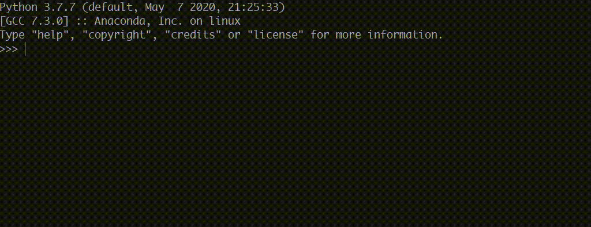

# Pororo: A Deep Learning based Multilingual Natural Language Processing Library

<p align="center">
  <a href="https://github.com/kakaobrain/pororo/releases"></a>
  <a href="https://github.com/kakaobrain/pororo/blob/master/LICENSE"></a>
</p>

<br>



`Pororo` performs Natural Language Processing and Speech-related tasks.

It is easy to solve various subtasks in the natural language and speech processing field by simply passing the task name.

<br>

## Installation

- `Pororo` is based on `torch=1.6(cuda 10.1)`

- You can install a package through the command below:

```console
pip install pororo
```

- Or you can install it **locally**:

```console
git clone https://github.com/kakaobrain/pororo.git
cd pororo
pip install -e .
```

- For library installation for specific tasks other than the **common modules**, please refer to [INSTALL.md](INSTALL.md)

- For the utilization of **Automatic Speech Recognition**, [_wav2letter_](https://github.com/facebookresearch/wav2letter) should be installed separately. For the installation, please run the [asr-install.sh](asr-install.sh) file

```console
bash asr-install.sh
```

<br>

## Usage

- `Pororo` can be used as follows:
- First, in order to import `Pororo`, you must execute the following snippet

```python
>>> from pororo import Pororo
```

- After the import, you can check the tasks currently supported by the `Pororo` through the following commands

```python
>>> from pororo import Pororo
>>> Pororo.available_tasks()
"Available tasks are ['mrc', 'rc', 'qa', 'question_answering', 'machine_reading_comprehension', 'reading_comprehension', 'sentiment', 'sentiment_analysis', 'nli', 'natural_language_inference', 'inference', 'fill', 'fill_in_blank', 'fib', 'para', 'pi', 'cse', 'contextual_subword_embedding', 'similarity', 'sts', 'semantic_textual_similarity', 'sentence_similarity', 'sentvec', 'sentence_embedding', 'sentence_vector', 'se', 'inflection', 'morphological_inflection', 'g2p', 'grapheme_to_phoneme', 'grapheme_to_phoneme_conversion', 'w2v', 'wordvec', 'word2vec', 'word_vector', 'word_embedding', 'tokenize', 'tokenise', 'tokenization', 'tokenisation', 'tok', 'segmentation', 'seg', 'mt', 'machine_translation', 'translation', 'pos', 'tag', 'pos_tagging', 'tagging', 'const', 'constituency', 'constituency_parsing', 'cp', 'pg', 'collocation', 'collocate', 'col', 'word_translation', 'wt', 'summarization', 'summarisation', 'text_summarization', 'text_summarisation', 'summary', 'gec', 'review', 'review_scoring', 'lemmatization', 'lemmatisation', 'lemma', 'ner', 'named_entity_recognition', 'entity_recognition', 'zero-topic', 'dp', 'dep_parse', 'caption', 'captioning', 'asr', 'speech_recognition', 'st', 'speech_translation', 'ocr', 'srl', 'semantic_role_labeling', 'p2g', 'aes', 'essay', 'qg', 'question_generation', 'age_suitability']"
```

- To check which models are supported by each task, you can go through the following process

```python
>>> from pororo import Pororo
>>> Pororo.available_models("collocation")
'Available models for collocation are ([lang]: ko, [model]: kollocate), ([lang]: en, [model]: collocate.en), ([lang]: ja, [model]: collocate.ja), ([lang]: zh, [model]: collocate.zh)'
```

- If you want to perform a specific task, you can put the task name in the `task` argument and the language name in the `lang` argument

```python
>>> from pororo import Pororo
>>> ner = Pororo(task="ner", lang="en")
```

- After object construction, it can be used in a way that passes the input value as follows:

```python
>>> ner("Michael Jeffrey Jordan (born February 17, 1963) is an American businessman and former professional basketball player.")
[('Michael Jeffrey Jordan', 'PERSON'), ('(', 'O'), ('born', 'O'), ('February 17, 1963)', 'DATE'), ('is', 'O'), ('an', 'O'), ('American', 'NORP'), ('businessman', 'O'), ('and', 'O'), ('former', 'O'), ('professional', 'O'), ('basketball', 'O'), ('player', 'O'), ('.', 'O')]
```

- If task supports multiple languages, you can change the `lang` argument to take advantage of models trained in different languages.

```python
>>> ner = Pororo(task="ner", lang="ko")
>>> ner("마이클 제프리 조던(영어: Michael Jeffrey Jordan, 1963년 2월 17일 ~ )은 미국의 은퇴한 농구 선수이다.")
[('마이클 제프리 조던', 'PERSON'), ('(', 'O'), ('영어', 'CIVILIZATION'), (':', 'O'), (' ', 'O'), ('Michael Jeffrey Jordan', 'PERSON'), (',', 'O'), (' ', 'O'), ('1963년 2월 17일 ~', 'DATE'), (' ', 'O'), (')은', 'O'), (' ', 'O'), ('미국', 'LOCATION'), ('의', 'O'), (' ', 'O'), ('은퇴한', 'O'), (' ', 'O'), ('농구 선수', 'CIVILIZATION'), ('이다.', 'O')]
>>> ner = Pororo(task="ner", lang="ja")
>>> ner("マイケル・ジェフリー・ジョーダンは、アメリカ合衆国の元バスケットボール選手")
[('マイケル・ジェフリー・ジョーダン', 'PERSON'), ('は', 'O'), ('、アメリカ合衆国', 'O'), ('の', 'O'), ('元', 'O'), ('バスケットボール', 'O'), ('選手', 'O')]
>>> ner = Pororo(task="ner", lang="zh")
>>> ner("麥可·傑佛瑞·喬丹是美國退役NBA職業籃球運動員，也是一名商人，現任夏洛特黃蜂董事長及主要股東")
[('麥可·傑佛瑞·喬丹', 'PERSON'), ('是', 'O'), ('美國', 'GPE'), ('退', 'O'), ('役', 'O'), ('nba', 'ORG'), ('職', 'O'), ('業', 'O'), ('籃', 'O'), ('球', 'O'), ('運', 'O'), ('動', 'O'), ('員', 'O'), ('，', 'O'), ('也', 'O'), ('是', 'O'), ('一', 'O'), ('名', 'O'), ('商', 'O'), ('人', 'O'), ('，', 'O'), ('現', 'O'), ('任', 'O'), ('夏洛特黃蜂', 'ORG'), ('董', 'O'), ('事', 'O'), ('長', 'O'), ('及', 'O'), ('主', 'O'), ('要', 'O'), ('股', 'O'), ('東', 'O')]
```

- If the task supports **multiple models**, you can change the `model` argument to use another model.

```python
>>> from pororo import Pororo
>>> mt = Pororo(task="mt", lang="multi", model="transformer.large.multi.mtpg")
>>> fast_mt = Pororo(task="mt", lang="multi", model="transformer.large.multi.fast.mtpg")
```

<br>

## Documentation

For more detailed information, see [full documentation](https://kakaobrain.github.io/pororo/)

<br>

## Citation

If you apply this library to any project and research, please cite our code:

```
@misc{pororo,
  author       = {Heo, Hoon and Park, Kyubyong and Ko, Hyunwoong and
                  Kim, Soohwan and Han, Gunsoo and Park, Jiwoo},
  title        = {Pororo: A Deep Learning based Multilingual Natural Language Processing Library},
  howpublished = {\url{https://github.com/kakaobrain/pororo}},
  year         = {2021},
}
```

<br>

## Contributors

[Hoon Heo](https://github.com/huffon), [Kyubyong Park](https://github.com/Kyubyong), [Hyunwoong Ko](https://github.com/hyunwoongko), [Soohwan Kim](https://github.com/sooftware), [Gunsoo Han](https://github.com/robinsongh381) and [Jiwoo Park](https://github.com/bernardscumm)

<br>

## License

`Pororo` project is licensed under the terms of **the Apache License 2.0**.

Copyright 2021 Kakao Brain Corp. <https://www.kakaobrain.com> All Rights Reserved.
